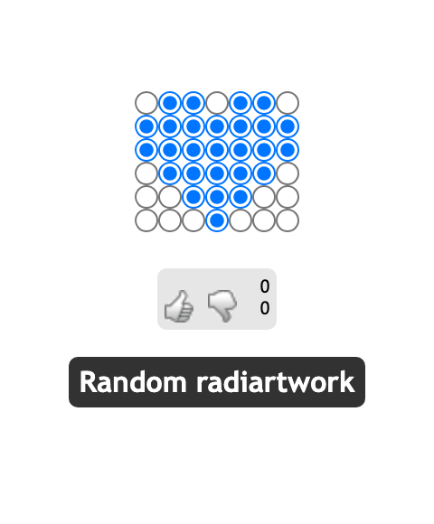

# Radiarts

A web app that turns HTML radio buttons into a pixel-art medium.
Visitors paint by toggling a grid of radio buttons, save the result,
browse a gallery of other people's pieces, and vote them up or down.




## Pages

File           | Purpose
---------------|----------------------------------------------------------------
`index.php`    | Home page with a featured logo and a random radiartwork
`paint.php`    | Drawing canvas with adjustable resolution
`database.php` | Gallery, sortable by size, date, or rating
`display.php`  | Single-piece view with up/down voting


## Requirements

- PHP with the `pdo_sqlite` extension.

The database file is `dbs/index.sqlite`.
The schema is created on first request (see `inc/db.inc.php`).


## Development

A `flake.nix` provides a dev shell:

```sh
nix develop
```

Check out the [makefile](./makefile) for available tasks.
